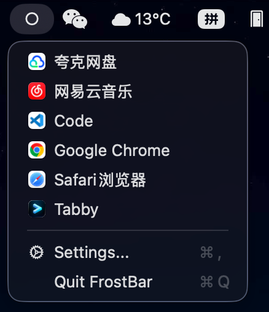
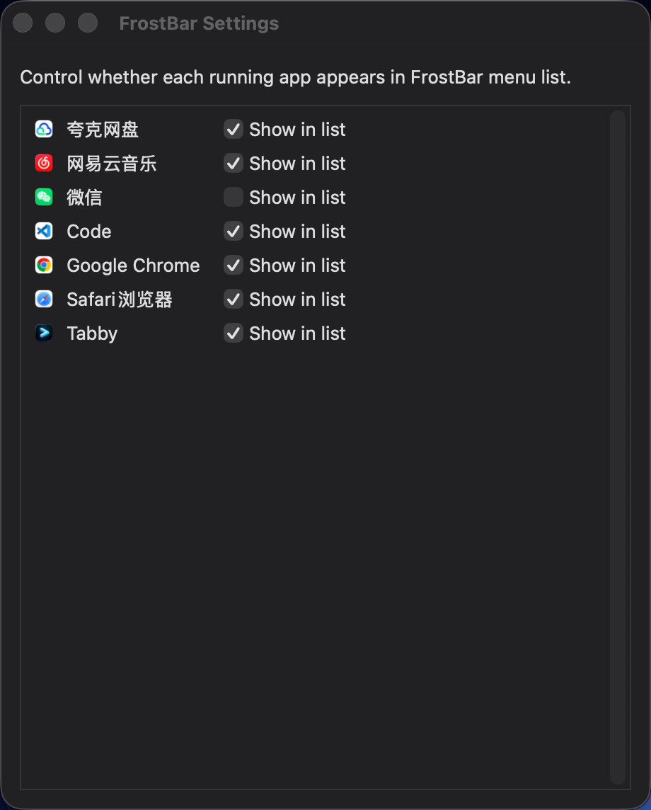

# FrostBar

FrostBar is a lightweight macOS menu bar app for quick app switching.

## Current behavior

1. Click FrostBar in the menu bar to see currently running apps using `regular + usable accessory` mode:
	- all regular desktop apps,
	- plus accessory apps that are usable (has visible window or matches allow keywords such as `uu`, `quark`, `v2ray`, `wechat`, `tencent`).
2. Open FrostBar Settings to choose which apps are shown or hidden in that list.
3. Click an app in the FrostBar list to bring its window to front.

## UI details

- Menu bar indicator:
	- Closed state: solid circle.
	- Open state: hollow circle.
- Settings rows are aligned as:
	- icon + app name + checkbox + "Show in list".
- App icon uses `FrostBar.jpeg` converted to `FrostBar.icns` during packaging.

## Screenshots

### MenuBar


### FrostBar



### Setting



## DMG install layout

The installer DMG is configured for drag-and-drop install:

- Left: `FrostBar.app`
- Right: `Applications`

## Project layout

- `app-swift/Sources/App/main.swift`
	- Menu bar UI, app discovery, activation, and settings window.
- `app-swift/Sources/App/VisibilityStore.swift`
	- Hidden app persistence model used by tests.
- `tests/visibility_store_test.swift`
	- Logic tests for hidden/show settings behavior.
- `scripts/package_and_test.sh`
	- One command for test + build + sign + package + DMG verification.

## Build, test, and package

Run:

```bash
bash scripts/package_and_test.sh
```

Pipeline steps:

1. Run logic tests.
2. Build Swift app executable.
3. Assemble `.app` bundle.
4. Convert icon and write app metadata.
5. Code sign app.
6. Create DMG with Finder layout.
7. Verify DMG by mounting and checking bundle contents.

Final artifact:

- `dist/FrostBar.dmg`
